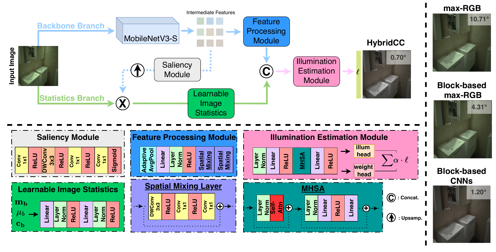

# Multi-Block-Attention-based Color Constancy (ECCV 2026)

*[Oguzhan Ulucan](https://scholar.google.com/citations?user=GDBJBzMAAAAJ), [Diclehan Ulucan](https://scholar.google.com/citations?user=JB3hc3cAAAAJ), and [Marc Ebner](https://scholar.google.com/citations?user=uA-5xdIAAAAJ)*

University of Greifswald, Germany

> Code and trained models for 
> "Multi-Block-Attention-based Color Constancy".

## 1. Overview

HybridCC is a compact color constancy model that combines the classical statistical assumptions 
with the learned features, requiring no camera-specific calibration or metadata. 

<p align="center">
  
</p>

HybridCC aims to solve the block-aggregation bias, which is one of the open problems of 
color constancy methods that work in a block-based manner. Generally, block-based methods
estimate the illuminant from local regions, but naively averaging these estimates
introduces an aggregation bias: large uniform areas such as sky or grass produce many
similar blocks that dominate the final prediction. HybridCC addresses this with a
multi-head self-attention mechanism over block-level representations, the first use 
of self-attention for this purpose in color constancy. The model achieves 
strong results across five benchmarks under two
protocols, with particularly robust performance on the worst-25% scores.

The model processes an image in a
block-based manner through two complementary branches:

- **Backbone branch** — a MobileNetV3-Small extracts scene features and predicts
  saliency maps that adaptively identify reliable regions for illuminant estimation,
  eliminating hand-tuned percentile thresholds.
- **Statistics branch** — guided by the saliency maps, it computes per-block
  illumination priors using a temperature-controlled soft-maximum formulation, a
  differentiable generalization of white-patch Retinex.

Features from both branches are fused and refined through multi-head self-attention,
allowing blocks with weak cues to benefit from informative ones and yielding more stable 
estimates. The refined features produce per-block illuminant estimates and combination 
weights that yield the final global illuminant.

## 2. Datasets

Currently we support **Intel-TAU**, **Gehler-Shi**, **NUS-8**, **Cube+**, and test set of **TA-AWB**.

Each dataset is organized under `Dataset/<name>/`:

```
Dataset/
  gehler/
    all_images/       
    train_csv/{train.csv, val.csv}
    test_csv/test.csv
  cube/    
    all_images/        
    train_csv/{train.csv, val.csv}
    test_csv/test.csv
  nus/
    all_images/
    train_csv/, test_csv/
  intel/  ...
  ta-awb/  ...
    cs/                # cross-sensor splits
      cs_Canon1DsMkIII/{train_csv, test_csv}
      ...
```

The CSV split files store the image names and their ground-truth illuminant.

### Preprocessing

- **Intel-TAU**: used as distributed (black-level corrected, color-checker masked).
- **TA-AWB**: used as distributed (black-level corrected). 
- **Gehler-Shi**: download the reprocessed ColorChecker dataset and apply the provided
  masks (ColorChecker, saturated, clipped pixels). We used the RECommended (2018) version 
[colorconstancy.com datasets page](https://www.colorconstancy.com/evaluation/datasets/index.html#colorcheckerhemrit).  
- **NUS-8** and **Cube+**: download the datasets and then run `preprocessing/process_nus.py` 
and `preprocessing/process_cube.py` (see `preprocessing/` for usage and config files).

## 3. Requirements

### Environment Setup

This project is developed with Python 3.13, PyTorch 2.6.0 (CUDA 12.4), on an NVIDIA RTX 4090.

### Package Installation

```bash
pip install -r requirements.txt
```

## 4. Usage

### 4.1 Evaluation Protocols

We follow common evaluation protocols to benchmark our model:

- **Leave-one-out** — train on three datasets, test on the held-out
  one, ensuring no camera overlap. For example, to test on NUS-8, train on Intel-TAU,
  Gehler-Shi, and Cube+.
- **Cross-sensor (NUS-8 CS)** — hold out one NUS-8 camera for testing, train on the
  remaining cameras; repeat for each camera and average across folds.

### 4.2 Training

Edit the dataset paths in `configs/train.yaml`, then run:

```bash
python train.py --config configs/train.yaml
```

Training supports single- or multi-source datasets. With multiple sources and
`balance_sources: true`, a balanced sampler ensures each dataset contributes equally
per epoch regardless of its size.

### 4.3 Evaluation

Edit `configs/evaluate.yaml` to point to the test CSV, image root, and checkpoint, then:

```bash
python evaluate.py --config configs/evaluate.yaml
```

This will calculate and save the angular error statistics into the specified directory.

Make sure the checkpoint matches the protocol: to evaluate on a dataset, use the
checkpoint trained **without** that dataset. Reported per-dataset checkpoints are
provided under `REPORTED_RESULTS/<DATASET>/best.ckpt`.

### 4.4 Inference Time and Model Size

The model is **1.07 MB** (~0.280M parameters) and runs at **~2.2 ms** per image
on an NVIDIA RTX 4090.

## 5. Results

| Dataset       | Mean | Median | Best 25% | Worst 25% |
|---------------|------|--------|----------|-----------|
| Gehler-Shi    | 2.11 | 1.60   | 0.53     | 4.65      |
| NUS-8         | 2.26 | 1.79   | 0.60     | 4.78      |
| NUS-8 (CS)    | 1.58 | 1.36   | 0.55     | 2.97      |
| Cube+         | 1.56 | 1.11   | 0.38     | 3.49      |
| Intel-TAU     | 2.21 | 1.70   | 0.59     | 4.75      |
| TA-AWB        | 2.63 | 1.95   | 0.52     | 5.80      |

## 6. Pretrained Models

Checkpoints are provided under `REPORTED_RESULTS/`:

```
REPORTED_RESULTS/
  GEHLER/best.ckpt     # test on Gehler-Shi (trained on Intel-TAU + NUS-8 + Cube+)
  NUS/best.ckpt        # test on NUS-8     (trained on Intel-TAU + Gehler-Shi + Cube+)
  CUBE/best.ckpt       # test on Cube+     (trained on Intel-TAU + Gehler-Shi + NUS-8)
  INTEL/best.ckpt      # test on Intel-TAU (trained on Gehler-Shi + NUS-8 + Cube+)
  TA-AWB/best.ckpt     # test on TA-AWB (trained on all others)
  NUS-CS/              # NUS-8 cross-sensor: one checkpoint per held-out camera
    Canon1DsMkIII/best.ckpt
    Canon600D/best.ckpt
    FujifilmXM1/best.ckpt
    NikonD5200/best.ckpt
    OlympusEPL6/best.ckpt
    PanasonicGX1/best.ckpt
    SamsungNX2000/best.ckpt
    SonyA57/best.ckpt
```

## 7. Citation

*(Citation will be added upon publication.)*
* Will appear in ECCV 2026. 

## 8. License

This work is licensed under a
[Creative Commons Attribution-NonCommercial 4.0 International License (CC BY-NC 4.0)](https://creativecommons.org/licenses/by-nc/4.0/).

